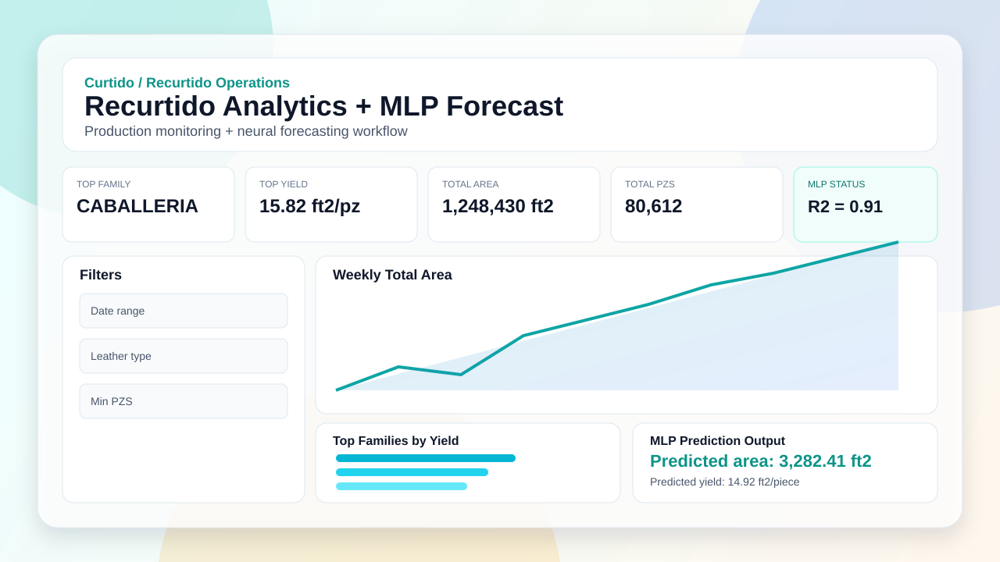
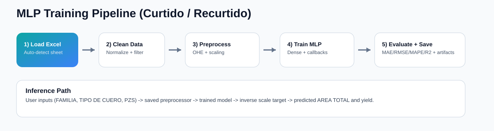

# Curtido / Recurtido MLP Dashboard



An employer-ready analytics app for **curtido/recurtido** production that combines:

- an interactive Dash dashboard for operations monitoring
- an MLP neural network for `AREA TOTAL (ft2)` forecasting

## Demo Assets

- UI preview: `docs/dashboard-preview.svg`
- MLP logic diagram: `docs/mlp-pipeline.svg`



## Project Context: Curtido vs Recurtido

- **Curtido**: broader leather treatment context
- **Recurtido**: retanning stage used for this app/model scope

This project focuses on recurtido process records and predicts expected production area from key operational features.

## Recruiter Snapshot

- Full-stack data product: model training + inference + interactive dashboard
- Reusable workflow for any similarly structured Excel dataset
- Production-focused metrics and interpretable KPIs for decision support

## Results Section (auto-generated from your local run)

Model evaluation metrics are automatically produced during training and saved in:

- `artifacts/recurtido_metrics.joblib`

Metrics tracked:

- MAE
- RMSE
- MAPE
- R2
- train/test row counts

To display your latest results in terminal:

```bash
python mlp_recurtido.py train --excel-path "$RECURTIDO_EXCEL_PATH"
```

The training command prints a JSON metrics summary after fitting.

## How the MLP works (logic)

`mlp_recurtido.py` pipeline:

1. Load Excel data and auto-detect worksheet (prefers `RECURTIDO` first).
2. Validate required columns:
   - `TIPO DE CUERO`
   - `FAMILIA`
   - `PZS`
   - `AREA TOTAL (ft2)`
3. Clean/standardize:
   - normalize text (`strip`, `upper`, missing token replacement)
   - coerce numerics
   - remove invalid rows (`PZS <= 0`, `AREA <= 0`)
4. Split data into train/test (`80/20`).
5. Build preprocessing:
   - OneHotEncoder for categorical features
   - StandardScaler for `PZS`
6. Scale target (`AREA TOTAL (ft2)`) with a dedicated scaler.
7. Train MLP regressor:
   - Dense(96) -> Dropout(0.10) -> Dense(48) -> Dense(16) -> Dense(1)
   - optimizer: Adam
   - loss: MSE
   - callbacks: EarlyStopping + ReduceLROnPlateau
8. Evaluate on held-out test set (MAE, RMSE, MAPE, R2).
9. Save inference artifacts:
   - model (`.keras`)
   - preprocessor
   - target scaler
   - metrics dictionary

Inference (`predict_area_total`) reuses saved artifacts to return:

- predicted total area (`ft2`)
- predicted yield (`ft2 / piece`)

## Tech Stack

- Python
- Dash + Dash Mantine Components
- Plotly
- scikit-learn
- TensorFlow / Keras
- pandas / NumPy

## Setup

```bash
python3 -m venv .venv
source .venv/bin/activate
pip install -r requirements.txt
```

## Data Requirements

Required columns:

- `FECHA`
- `TIPO DE CUERO`
- `FAMILIA`
- `PZS`
- `AREA TOTAL (ft2)`

See `DATA_SCHEMA.md` for full details.

## Bring Your Own Data

Option 1. Place file in default location:

- `data/datosProd.xlsx`

Option 2. Use environment variables:

```bash
export RECURTIDO_EXCEL_PATH="/absolute/path/to/your_data.xlsx"
export RECURTIDO_SHEET_NAME="RECURTIDO"
```

## Validate Dataset

```bash
python mlp_recurtido.py validate --excel-path "$RECURTIDO_EXCEL_PATH"
```

## Train Model

```bash
python mlp_recurtido.py train --excel-path "$RECURTIDO_EXCEL_PATH"
```

## Run Dashboard

```bash
python app.py
```

Open: `http://127.0.0.1:8050`

If 8050 is already in use:

```bash
python -c "from app import app; app.run(host='127.0.0.1', port=8051, debug=True)"
```

## Quick CLI Prediction

```bash
python mlp_recurtido.py predict --familia "XYZ" --tipo-cuero "ABC" --pzs 220
```

## Repo Structure

```text
.
├── app.py
├── mlp_recurtido.py
├── DATA_SCHEMA.md
├── requirements.txt
├── assets/
│   └── styles.css
├── docs/
│   ├── dashboard-preview.svg
│   └── mlp-pipeline.svg
├── data/
│   └── .gitkeep
└── artifacts/
    └── .gitkeep
```

## Notes

- Datasets and trained artifacts are intentionally gitignored.
- Share code/workflow publicly; keep sensitive source data local.
